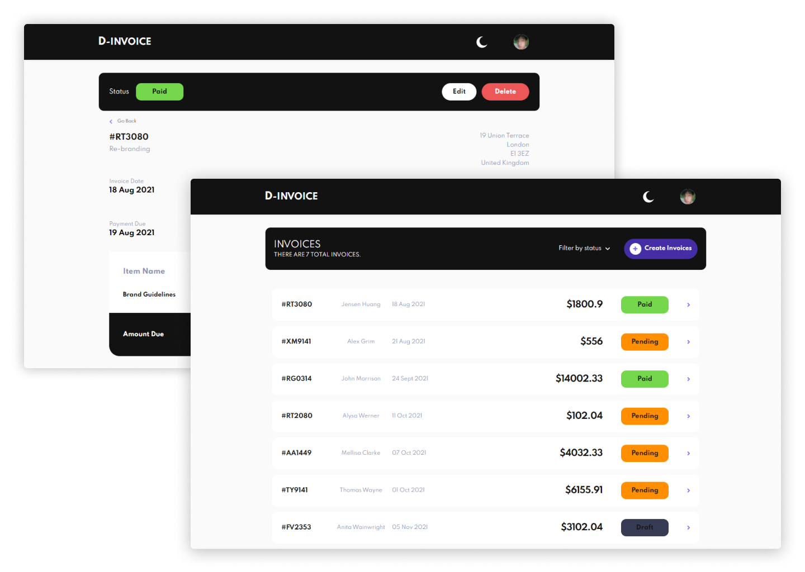

# Invoice app



## Table of contents

-   [Overview](#overview)
    -   [Intro](#intro)
    -   [Usage](#usage)
    -   [Links](#links)
-   [My process](#my-process)
    -   [Built with](#built-with)
    -   [Features](#features)
-   [Setup](#setup)
-   [Useful resources](#useful-resources)

## Overview

### Intro

Hi! This is an **invoicing application** a built with **_React JS_** and **_tailwindCSS_**.  This project help me understand how to perform a CRUD operation with context API. All transitions are smoothly displayed by using **Framer Motion** library to create animations.

### Usage

-   Invoices can be created either as drafts or as pending. Clicking _"Save as Draft"_ allow the user to leave any form field blank and set the status to _"draft"_. Clicking _"Save & Send"_ require all forms fields to be filled in, and set the status to _"pending"_.
-   When saving changes to an invoice, all fields are required when the _"Save Changes"_ button is clicked. If the user clicks _"Cancel"_, any unsaved changes reset.
-   If the invoice being edited is a _"draft"_ and the _"Save Changes"_ button is clicked the status update to _"pending"_. All fields are required at this stage.
-   Clicking the _"Mark as Paid"_ button change the invoice's status to _"paid"_. This option is displayed only when the invoice status is _"pending"_.
-   Users receive a confirmation modal when trying to _delete_ or _change_ status of invoice because both of those actions are irreversible.
-   Invoices list can be **filtered** by status (_draft/pending/paid_) by using _"Filter by status"_ button.
-   Keep track of any changes with `localStorage`.

### Links

-   [Benjo Quilario](https://www.benjoquilario.me/) Personal Portfolio 
-   [Live site URL](https://invoices-benjo.netlify.app/) to see live version.

## My process

My first building a CRUD operation and this is a largest and most comprehensive project I have done so far. The one that gave me headache is creating and updating a form because At first I am using a useRef() hook catch the changes and inputting user text but this project has many input field and I am using many useRef() hooks and I search what is the solution of it, and results gave me to used a **Formik (and Yup)** to handle the forms. 

### Built with

-   ReactJS
-   TailwindCSS
-   Framer Motion API
-   react-datepicker
-   Formik Library(Yup)
-   A11y
-   Mobile first
-   Semantic HTML5 markup

### Features

-  I used ReactJS library to create an app. At first I want to create this app using NextJS(A react frameworks), but I still not being used creating app with nextjs and this app was by far the largest and most comprehensive project I have done so far. It showed me how important it is to plan so that you don't have to change things that previously worked well in the middle of the project. A valuable lesson!.
-  I used tailwindCSS(A css framework) to create a user interface of the projects, I am using tailwindCSS so far and I loving it now.
-  It's my first time using Framer Motion API is an open source, production-ready library that's designed for creating creative animations. To animate the pages transitions and modals.
-  For Invoice Date picker I used React Date Picker package. This is a simple and reusable Datepicker component for React.
-  Watch Progress
-  I used a Context API on this projects using context API is really useful, passing props through props is really difficult in big projects like this one.
-  Clicking Esc and Clicking of background to exit a modal.

## Setup

To run this project, clone it and install it locally using npm:

```
$ git clone https://github.com/benjoquilario/crud-invoice-app.git
$ cd crud-invoice-app
$ npm install
```

Use npm to build and compile assets in a local environment:

```
$ npm run build
```

## Useful resources

-   [DOCS - ReactJS](https://reactjs.org/)
-   [DOCS- TailwindCSS](https://styled-components.com/)
-   [DOCS - Formik](https://formik.org/)
-   [LINK - useReducer hook](https://blog.logrocket.com/guide-to-react-usereducer-hook/)
-   [LINK - useContext hook](https://medium.com/technofunnel/usecontext-in-react-hooks-aa9a60b8a461)
-   [LINK - Prop Drilling "threading"](https://kentcdodds.com/blog/prop-drilling)
-   [LINK - ThemeProvider](https://css-tricks.com/a-dark-mode-toggle-with-react-and-themeprovider/)
-   [LINK - React Date Picker](https://www.npmjs.com/package/react-datepicker)
-   [LINK - Prettier](https://prettier.io/)
-   [DOCS - Framer Motion API](https://www.framer.com/api/motion/)
-   [DOCS - Framer Motion - useReducedMotion hook](https://www.framer.com/docs/guide-accessibility/)